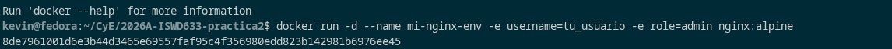
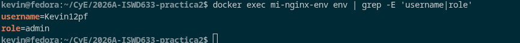
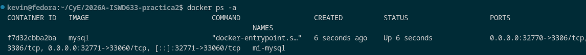
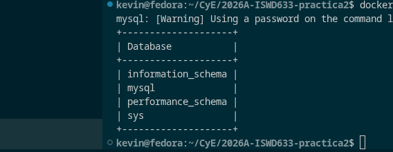

# Variables de Entorno

### ¿Qué son las variables de entorno?

# COMPLETAR

Variables de entorno son aquellas que pueden ser accedidas desde diferentes partes del programa. Existen a nivel de sistema operativo, donde pueden ser consultadas y modificadas por diferentes procesos y aplicaciones que se ejecutan en el sistema.

### Para crear un contenedor con variables de entorno

```
docker run -d --name <nombre contenedor> -e <nombre variable1>=<valor1> -e <nombre variable2>=<valor2>
```

### Crear un contenedor a partir de la imagen de nginx:alpine con las siguientes variables de entorno: username y role. Para la variable de entorno rol asignar el valor admin.

# COMPLETAR

# CAPTURA CON LA COMPROBACIÓN DE LA CREACIÓN DE LAS VARIABLES DE ENTORNO DEL CONTENEDOR ANTERIOR


Despues cambie el nombre de usuario


### Crear un contenedor con la imagen de mysql, mapear todos los puertos

# COMPLETAR

### ¿El contenedor se está ejecutando?

# COMPLETAR

docker run -d --name mi-mysql -P mysql

### Identificar el problema

# COMPLETAR

se debe configurar una variable de entorno para establecer la contraseña del administrador.

### Para crear un contenedor con variables de entorno especificadas

docker run -d --name mi-mysql -e MYSQL_ROOT_PASSWORD=secreta -P mysql


- Portabilidad: Las aplicaciones se vuelven más portátiles y pueden ser desplegadas en diferentes entornos (desarrollo, pruebas, producción) simplemente cambiando el archivo de variables de entorno.
- Centralización: Todas las configuraciones importantes se centralizan en un solo lugar, lo que facilita la gestión y auditoría de las configuraciones.
- Consistencia: Asegura que todos los miembros del equipo de desarrollo o los entornos de despliegue utilicen las mismas configuraciones.
- Evitar Exposición en el Código: Mantener variables sensibles como contraseñas, claves API, y tokens fuera del código fuente reduce el riesgo de exposición accidental a través del control de versiones.
- Control de Acceso: Los archivos de variables de entorno pueden ser gestionados con permisos específicos, limitando quién puede ver o modificar la configuración sensible.

### ¿Qué bases de datos existen en el contenedor creado?

docker exec -it mi-mysql mysql -uroot -psecreta -e "SHOW DATABASES;"


# COMPLETAR
