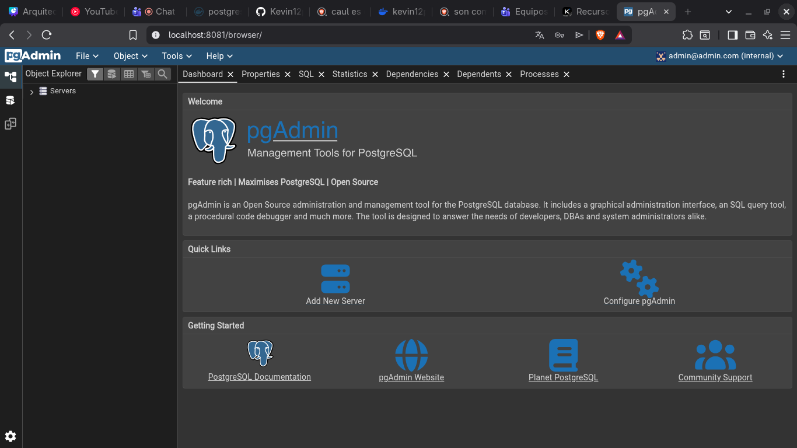
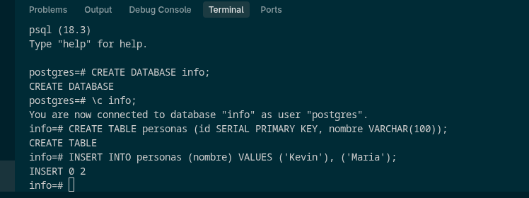
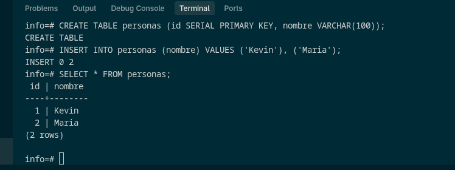

### Crear contenedor de Postgres sin que exponga los puertos. Usar la imagen: postgres:alpine

# COMPLETAR

docker run -d --name mi-postgres -e POSTGRES_PASSWORD=secreta postgres:alpine

### Crear un cliente de postgres. Usar la imagen: dpage/pgadmin4

docker run -d --name mi-pgadmin -p 8081:80 -e PGADMIN_DEFAULT_EMAIL=admin@admin.com -e PGADMIN_DEFAULT_PASSWORD=admin dpage/pgadmin4

# COMPLETAR

La figura presenta el esquema creado en donde los puertos son:

- **a:** `5432` (Puerto origen/interno por el cual se comunica y escucha Postgres)
- **b:** `8081` (Puerto host/mapeado de nuestra máquina para acceder a PgAdmin)
- **c:** `80` (Puerto de escucha interno del contenedor web PgAdmin)

## Desde el cliente

### Acceder desde el cliente al servidor postgres creado.

# COMPLETAR CON UNA CAPTURA DEL LOGIN

### Crear la base de datos info, y dentro de esa base la tabla personas, con id (serial) y nombre (varchar), agregar un par de registros en la tabla, obligatorio incluir su nombre.

docker exec -it mi-postgres psql -U postgres
CREATE DATABASE info;
\c info;
CREATE TABLE personas (id SERIAL PRIMARY KEY, nombre VARCHAR(100));
INSERT INTO personas (nombre) VALUES ('Kevin'), ('Maria');

## Desde el servidor postgresl

### Acceder al servidor

### Conectarse a la base de datos info

# COMPLETAR

### Realizar un select \*from personas

# AGREGAR UNA CAPTURA DE PANTALLA DEL RESULTADO

