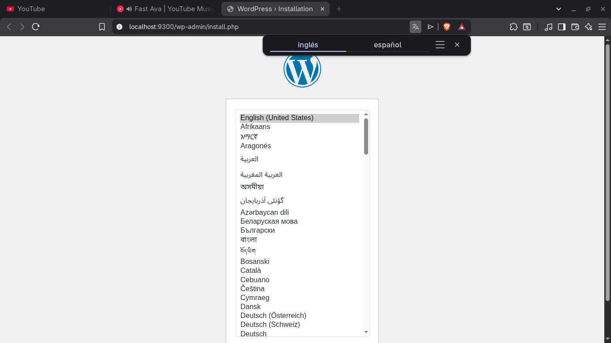
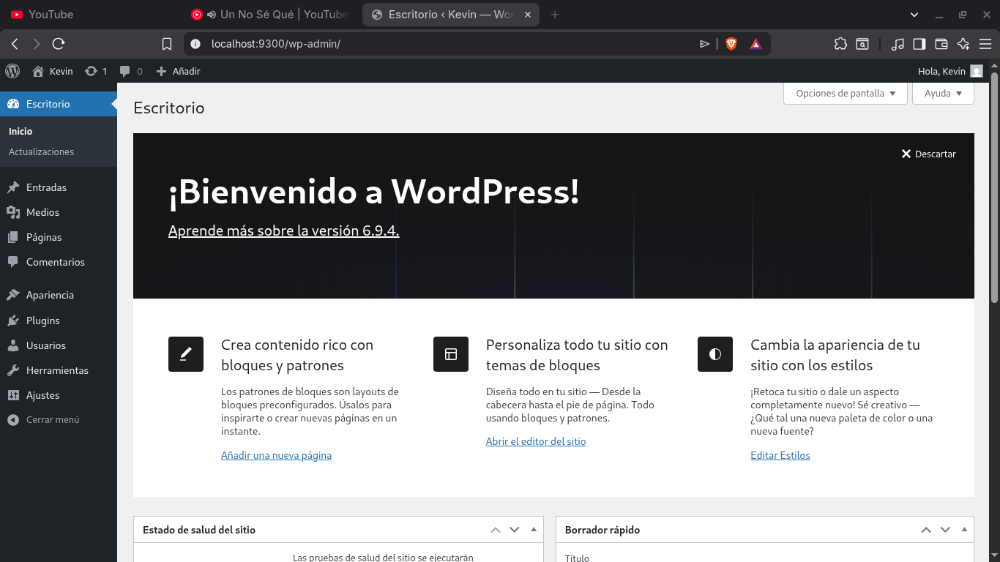

## Esquema para el ejercicio

### Crear la red

# COMPLETAR

docker network create red-wordpress -d bridge

### Crear el contenedor mysql a partir de la imagen mysql:8, configurar las variables de entorno necesarias

# COMPLETAR

docker run -d --name bd-wordpress --network red-wordpress \
 -e MYSQL_ROOT_PASSWORD=contrasena_segura \
 -e MYSQL_DATABASE=wordpress_db \
 -e MYSQL_USER=wp_user \
 -e MYSQL_PASSWORD=wp_pass \
 mysql:8

### Crear el contenedor wordpress a partir de la imagen: wordpress, configurar las variables de entorno necesarias

# COMPLETAR

docker run -d --name my-wordpress -p 9300:80 --network red-wordpress \
 -e WORDPRESS_DB_HOST=bd-wordpress:3306 \
 -e WORDPRESS_DB_USER=wp_user \
 -e WORDPRESS_DB_PASSWORD=wp_pass \
 -e WORDPRESS_DB_NAME=wordpress_db \
 wordpress

De acuerdo con el trabajo realizado, en el esquema del ejercicio el puerto a es **9300**

Ingresar desde el navegador al wordpress y finalizar la configuración de instalación.

# COLOCAR UNA CAPTURA DE LA CONFIGURACIÓN

Desde el panel de admin: cambiar el tema y crear una nueva publicación.
Ingresar a: http://localhost:9300/
recordar que a es el puerto que usó para el mapeo con wordpress

# COLOCAR UNA CAPTURA DEL SITO EN DONDE SEA VISIBLE LA PUBLICACIÓN.

### Eliminar el contenedor wordpress

# COMPLETAR

docker rm -f my-wordpress

### Crear nuevamente el contenedor wordpress

Ingresar a: http://localhost:9300/
recordar que a es el puerto que usó para el mapeo con wordpress

### ¿Qué ha sucedido, qué puede observar?

A pesar de haber eliminado el contenedor del sitio web de WordPress, al crearlo nuevamente y apuntarlo hacia la misma base de datos MySQL preexistente, **el sitio, el tema, la configuración y las publicaciones vuelven a estar allí sin necesidad de configuración adicional**.
Esto demuestra que el estado y los datos persistentes de la aplicación no estaban guardados en el contenedor web, sino centralizados en el servicio de base de datos MySQL, el cual nunca fue eliminado.

# COMPLETAR
